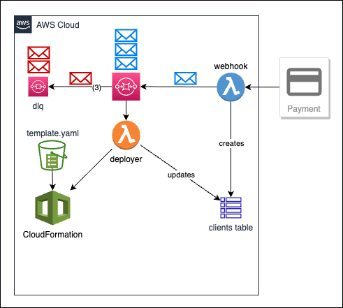

# After Payment Automatic Deployment

A serverless scalable application the deploys any cloudformation stack after a payment is made.

## Architecture

The application uses the following AWS services:

- **DynamoDB**: Stores and keeps track of the client information
  - Table: `Clients`
  - Stores: ID, name, email, and status

- **SQS Queue**: Decouples and act as a buffer between the payment event and the deployment
  - Includes Dead Letter Queue (DLQ) for failed messages
  - Maximum of 3 retries before moving to DLQ
  - FIFO queue to ensure message order

- **Lambda Function**: Receives the payment event and triggers the deployment
  - Runtime: Node.js
  - Two separate functions for payment and deployment ensuring scalablity

## How it Works

1. A payment is made by the client
2. The payment event is sent to the `webhook` lambda function
3. The `webhook` function validates the payment, stores the client info un DynamoDB and sends a message to the SQS queue.
4. The `deploy` lambda function is triggered by the SQS message, updates the client info in DynamoDB and deploys the cloudformation stack.

## Development

To use this example you need to customize the following:

- **Payment Gateway**: Replace the `isPaymentConfirmed` function in the `webhook` lambda function with your own payment gateway.
- **Cloudformation Stack**: Replace the `getTemplateBody` function in the `deployer` lambda function with your own cloudformation stack or use the `TemplateURL` property to point to an existing template.
- **AWS Account**: Update the `aws-on-demand-stack-deploy.ts` file with your own AWS account number and ensure you have a AWS Profile on your local machine.

## More Information

- **Blog Post**: [How to Deploy a Cloudformation Stack After a Payment is Made]()
